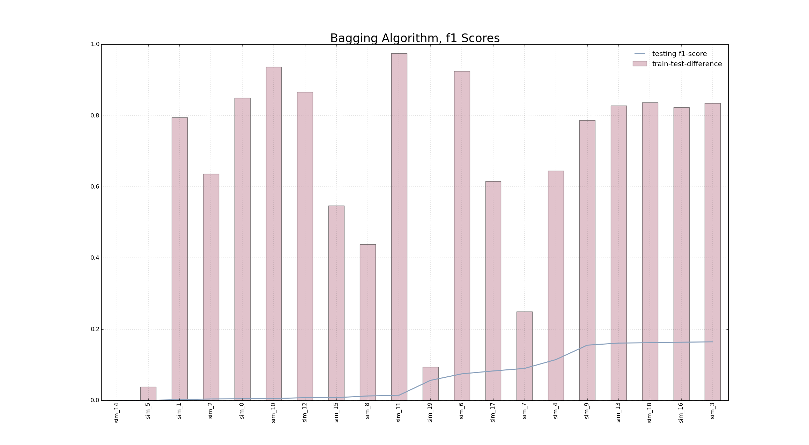
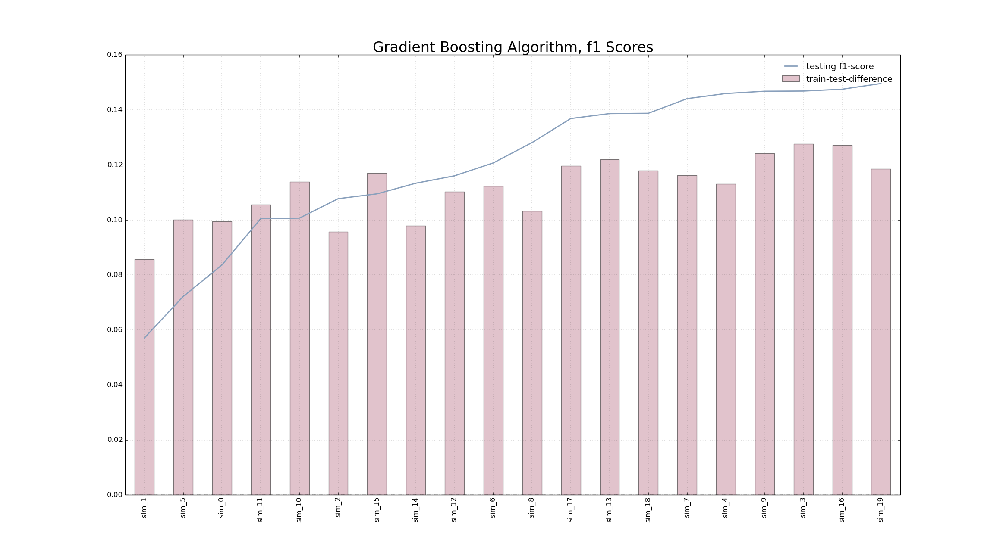

#README.md

##Methodology

##Continuous Feature Construction

### Price Ratios from Retail / Auction
Significance was found using the ratios of different auction values, which were then
incorporated into the features. The significant feature ratios and their respective "key values" are:

###Key Values

| Feature | Numerical Representation |
|:--------|:-------------------------|
|Acquisition Auction Clean Price | 1 |
|Acquisition Retail Avg Price | 2 |
|Acquisition Retail Clean Price | 3 |
|Current Retail Avg Price | 6 |
| Current Retail Clean Price | 7 |

###Feature Ratios

|Ratio |
|:-----|
|1 / 2 |
|1 / 3 |
|2 / 3 |
|2 / 6 |
|2 / 7 |
|3 / 6 |
|3 / 7 |

### Miles Per Year

The number of miles a car was driven per year was found to be of significant explanatory
power, which makes sense as it often refers to "how hard a car was driven."  Therefore,
`miles_per_year` is also included in the final feature selection

### Purchase Price as a Ratio of Auction / Retail

The purchase price of the car proportional to:

1. Acquisition Retail Clean Price
2. Current Auction Avg Price
3. Current Retail Clean Price

so those three features were also included in the data set

### Purchase Price over Warranty Cost

The Purchase price as a proportion of warranty cost served as a good feature
to predict whether a car was a lemon and was therefore included.

##Binary Feature Construction

###At Risk Models

Certain models and years exhibited a higher propensity to being bad purchases,
therefore another value entitield "model_year" was created, and the 15 most
"at risk" `model_years` were included in the analysis, where 1 (if they were
an "at risk `model_year`) or 0 if they were not

##Discrete Feature Construction

The zipcode of where the car was purchased was not as significant as the "first three
digits" of the zipcode, which allowed for the "general region of the auction" to be
calculated. therefore, the `trunctated_zipcode` appears in the final training data
displaying only the first 3 digits of the zipcode.

##Chosen Algorithms

Both the Gradient boost and the BaggingClassifier were used to test the efficacy
of the prediction algorithm.

In general, the Bagging Classifier had greater disparity between the f1_score of the
training and testing. In gneral, as the `max_sample` parameter was increased, so too the the disparity between the f1-train and f1-test increased. However, this was not
the case with the Gradient Boost Algorithm. Similar values for the f1-train and f1-test
were achieved for different values of `max_sample`, leading to greater predictability
of the algorithm. Therefore, Gradient Boost was chosen as our Classification Algorithm.

##Results

Overall, the Boosting algorithm provided greater consistently between in-sample and out-of-sample f1 scores, and therefore was our algorithm of choice.
